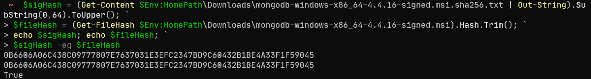
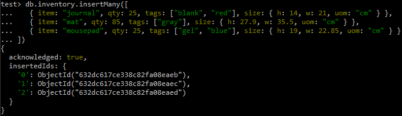
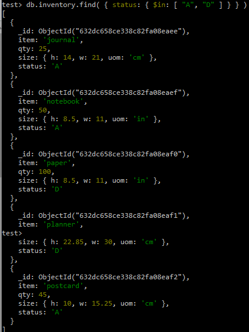
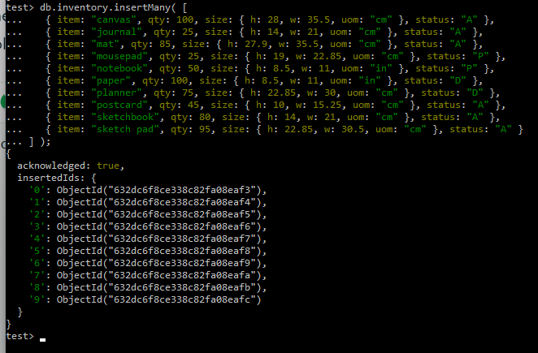
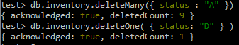
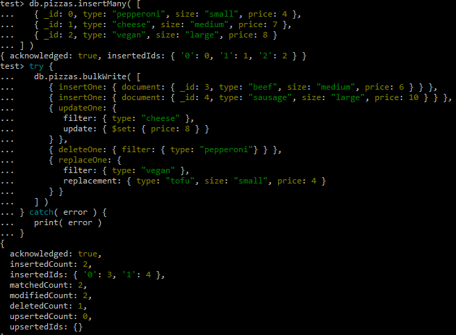
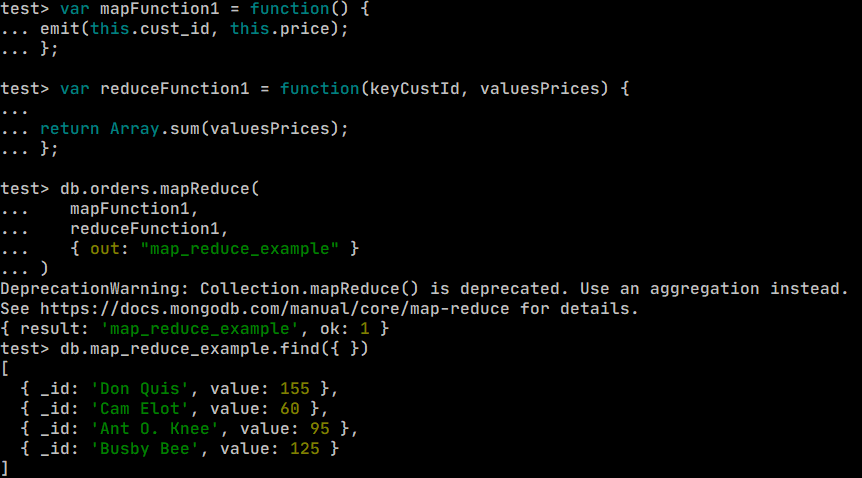
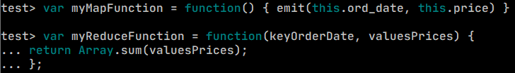
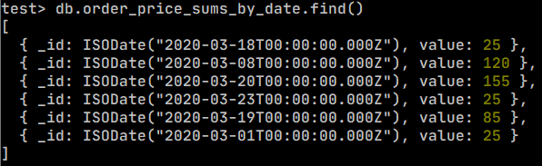

# DAT250 Assignment 3

## Installation
No installation issues during this experiment.

## Validation

## Experiment 1 - MongoDB CRUD operations
### Insert

### Query

### Update

### Remove

### Bulk write

## Experiment 2 - Aggregation
### Example

### Custom
Custom map and reducer functions

Output

This map-reduce creates a table with sum of all orders by date which could enable easier access to overall sales/orders per day.